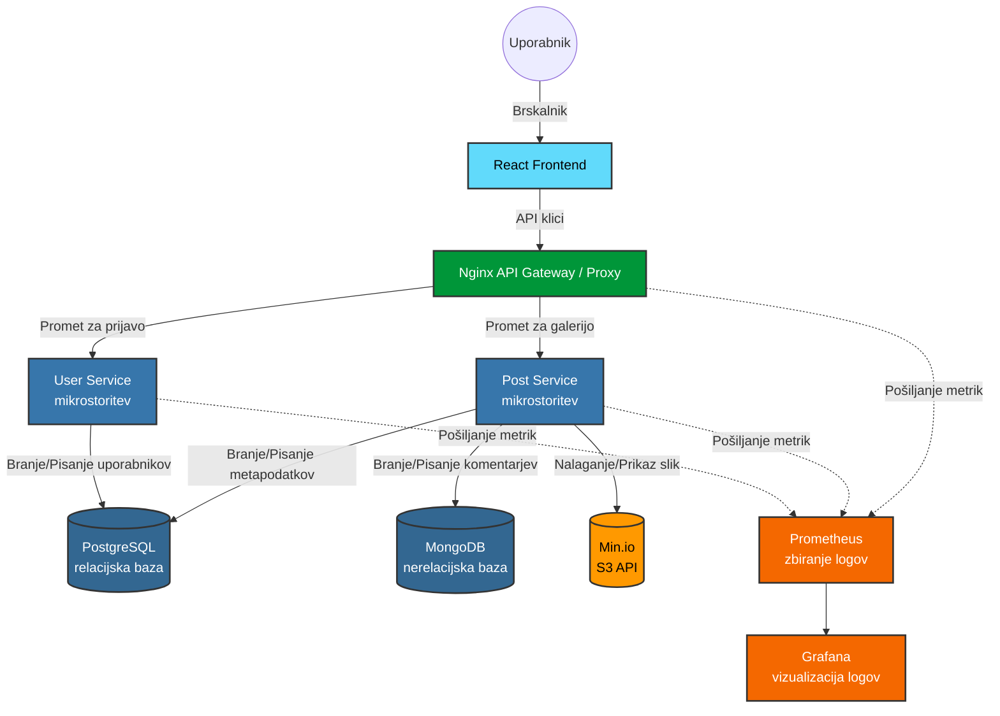

# nuks_projekt
nuks_projekt

## 1. Ideja za projekt in opis (Mejnik 1)
Cilj projekta je razviti platformo, kjer se lahko amaterski astrofotografi registrirajo, ustvarijo svoj profil in delijo svoje fotografije vesolja. Po vzoru platform kot sta Astrobin in Telescopius.

Glavne funkcionalnosti bodo vključevale:
* Registracijo in prijavo uporabnikov.
* Nalaganje slikovnega materiala.
* Zapisovanje metapodatkov o fotografiji (uporabljen teleskop, kamera, montaža, čas ekspozicije, filtri).
* Pregledovanje in branje objav drugih uporabnikov (galerija).

## 2. Načrtovana arhitektura:

* **Frontend:** React (za prikaz galerije in interakcijo z uporabnikom).
* **API Gateway / Proxy:** Nginx (usmerjanje prometa do ustreznih mikrostoritev).
* **Mikrostoritve (Backend):** * `User Service` (Python/FastAPI) - upravljanje uporabnikov in avtentikacije.
    * `Post Service` (Python/FastAPI) - upravljanje objav, metapodatkov in logike za slike.
* **Podatkovne baze:** * PostgreSQL (relacijska baza za uporabnike in metapodatke).
    * MongoDB (nerelacijska baza za shranjevanje komentarjev in dodatnih dinamičnih podatkov).
* **Shranjevanje datotek:** S3 API / Min.io instanca (shranjevanje slikovnih datotek).
* **Centralizirano logiranje:** Grafana in Prometheus.

## 3. Skica arhitekture

## 4. API Dokumentacija in Mikrostoritve (Mejnik 2)
Za potrebe aplikacije smo razdelili backend na dve ločeni mikrostoritvi. API dokumentacija se avtomatsko generira ob spremembah in je na voljo v obliki surovega JSON formata ter vizualne HTML predstavitve (ReDoc).

### Segmentacija mikrostoritev:

**1. User Service (Port 8000)**
Skrbi za avtentikacijo in upravljanje uporabniških profilov.
* **Vizualna dokumentacija (HTML):** [Odpri docs/user_docs.html](docs/user_docs.html)
* **Surovi podatki (JSON):** [`docs/user_api.json`](docs/user_api.json)

**2. Post Service (Port 8001)**
Skrbi za nalaganje astrofotografij (S3), branje galerije in komentiranje.
* **Vizualna dokumentacija (HTML):** [Odpri docs/post_docs.html](docs/post_docs.html)
* **Surovi podatki (JSON):** [`docs/post_api.json`](docs/post_api.json)
    